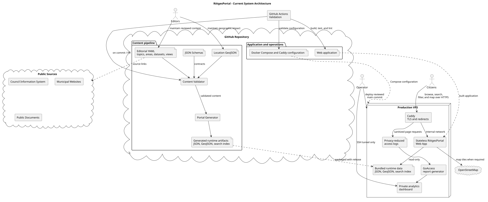
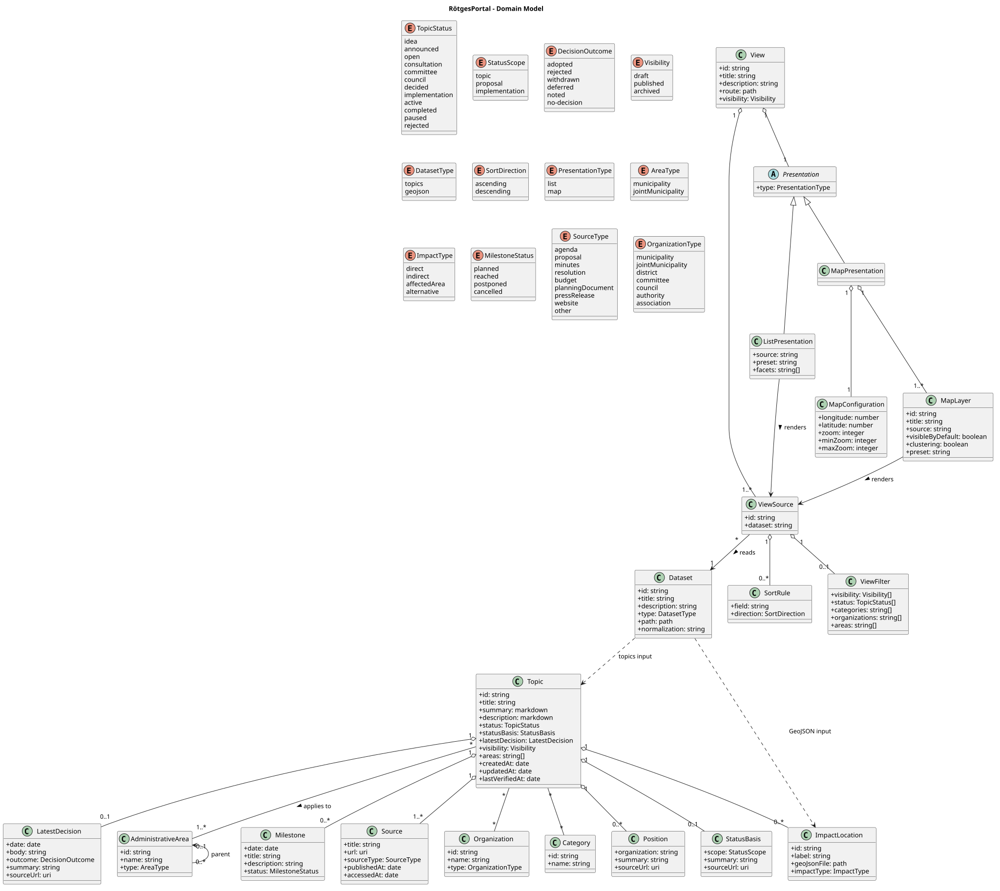
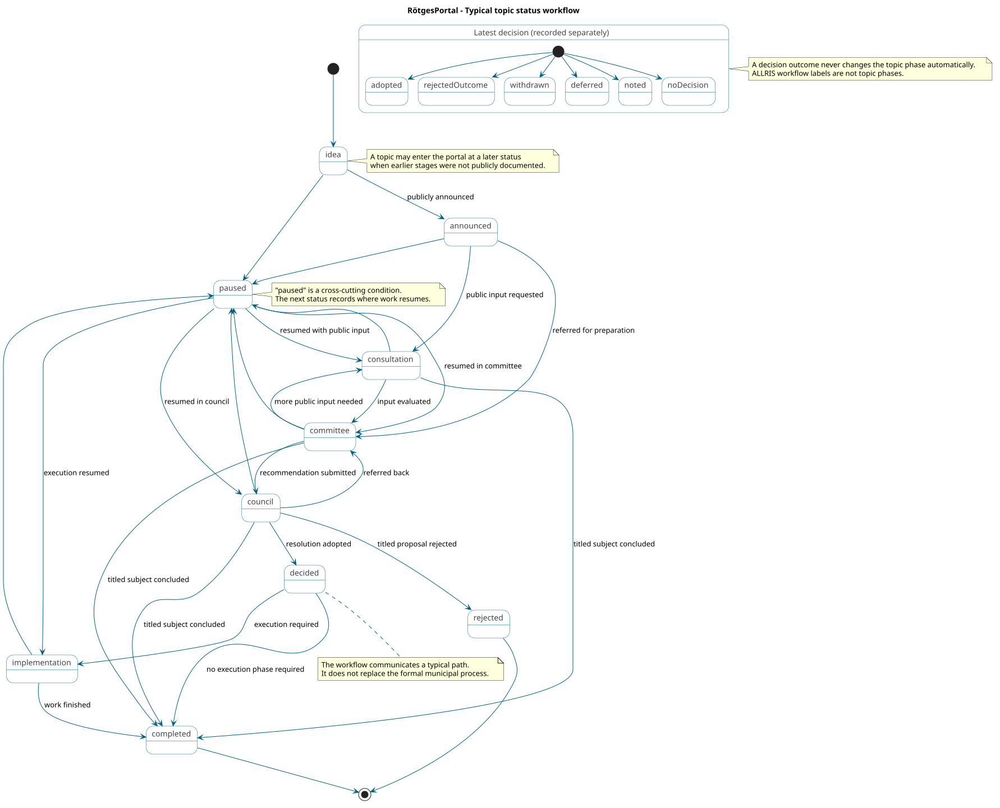

# RötgesPortal

RötgesPortal aims to present municipal topics in Rötgesbüttel neutrally,
transparently, and with their geographic impact. The project deliberately
starts as a statically generated portal: editorial content is maintained as
YAML and geographic data as GeoJSON. The MVP does not require a database.

## Architecture principle

> YAML is the editorial source of truth. The build produces optimized JSON,
> GeoJSON, and search data for the web application.

This approach keeps changes reviewable through Git, hosting simple, and the
attack surface small. A database can be added later behind a clear data access
layer if an editorial interface, roles, citizen contributions, or automated
imports require one.

## Architecture

### System architecture

[PlantUML source](docs/architecture/system-architecture.puml)



### Domain model

[PlantUML source](docs/architecture/domain-model.puml)



### Topic status workflow

[PlantUML source](docs/architecture/topic-status-workflow.puml)



The [content model](docs/architecture/content-model.md) defines collection,
reference, coordinate, and generated-output conventions.

The PlantUML sources are authoritative and the rendered SVG files are committed
for direct display on GitHub. After installing
[PlantUML](https://plantuml.com/starting), regenerate them with:

```bash
plantuml -tsvg docs/architecture/*.puml
```

## Repository structure

```text
.
├── content/
│   ├── datasets/        # reusable inputs with stable IDs
│   ├── locations/       # manually maintained GeoJSON sources
│   ├── topics/          # one municipal topic per YAML file
│   └── views/           # routes, data selection, and presentation
├── deploy/              # reproducible self-hosting baseline
├── docs/
│   ├── architecture/    # PlantUML sources and rendered SVG files
│   ├── brand/           # visual provenance and usage constraints
│   ├── governance/      # editorial, operating, and handover policies
│   └── operations/      # deployment, monitoring, and recovery
├── generated/           # generated runtime and import data
├── schemas/             # machine-readable content contracts
├── tools/               # validation, build, and historic imports
└── web/                 # static topic portal and future map application
```

## Importing Rötgesmarkt data

The existing GeoJSON transformation remains available as an import tool. It
corrects swapped latitude and longitude values, removes generated IDs, and
creates an additional CSV file for Google My Maps.

```bash
python3 tools/import_roetgesmarkt.py
```

Input:

```text
content/locations/roetgesmarkt_input.geojson
```

Outputs:

```text
generated/roetgesmarkt_upload.geojson
generated/roetgesmarkt_upload_google_maps.csv
```

The tool requires Python 3.9 or newer and has no external dependencies.

## Maintaining topics

Each topic file follows the contract in
[`schemas/topic.schema.json`](schemas/topic.schema.json). The initial example
at [`content/topics/example-topic.yaml`](content/topics/example-topic.yaml)
remains an unpublished draft.

Facts, geographic impact, and publicly documented positions are modeled
separately. Every published topic and position must cite at least one
verifiable source.

## Defining portal views

Datasets decouple physical inputs from their presentation:

```text
content/datasets/topics.yaml
content/datasets/roetgesmarkt-stands.yaml
```

Views select data independently from the way it is presented:

```text
content/views/council.yaml
content/views/council-map.yaml
content/views/flea-market.yaml
```

The published council views filter and sort the same topic data for a list and
a map route. The generator resolves topic location references into an enriched
GeoJSON layer for the map. The draft flea market view retains the normalized
historic Rötgesmarkt dataset for a future map route. Named view sources
separate filtering and sorting from list or map presentation, so the same
dataset can support multiple experiences without duplicating editorial
content.

Dataset and view files follow
[`schemas/dataset.schema.json`](schemas/dataset.schema.json) and
[`schemas/view.schema.json`](schemas/view.schema.json).

## Validating content

Install the development dependencies and run the content validator:

```bash
python3 -m pip install -r requirements-dev.txt
python3 tools/validate_content.py
```

In addition to the JSON Schemas, the validator checks IDs, file references,
dataset and source references, unique routes, source and layer IDs, zoom
ranges, and compatible filters. CI runs the same validation for every pull
request.

## Generating runtime data

The portal generator validates the complete content model before writing
public runtime artifacts:

```bash
python3 tools/build_portal.py
```

The deterministic build creates:

```text
generated/
├── datasets/            # datasets required by published views
├── topics/              # one JSON detail document per published topic
├── views/               # view index, manifests, and list data
└── search-index.json    # compact public topic search records
```

Draft and archived topics are excluded from public runtime data. Generated
list data includes status and category facets, stable sorting, links to topic
details, and the next planned milestone when one exists.

Run all local checks with:

```bash
python3 -m unittest discover -s tests -v
python3 tools/validate_content.py
python3 tools/build_portal.py
git diff --exit-code -- generated
```

## Web application

The public web application presents generated council topics as a
German-language list and an OpenStreetMap-based MapLibre view. Both provide
status and category filters and link to source-backed detail pages:

```bash
cd web
pnpm install
pnpm dev
```

The application synchronizes the generated public artifacts into its static
asset directory before development and production builds. It remains
independent from the editorial YAML and does not require a database.

## Public stewardship

The portal is prepared for transparent independent operation and a possible
future municipal handover:

- [Editorial policy](docs/governance/editorial-policy.md)
- [Operating model](docs/governance/operating-model.md)
- [Municipal handover checklist](docs/governance/municipal-handover.md)
- [Deployment procedure](docs/operations/deployment.md)
- [Monitoring and recovery](docs/operations/monitoring-and-recovery.md)
- [Visual identity](docs/brand/visual-identity.md)
- [Contribution guide](CONTRIBUTING.md)
- [Security policy](SECURITY.md)

The current UI uses an independent portal identity: a folded map becomes the
letter R and a gold location marker establishes local context. Official
municipal symbols are intentionally not used. Until an official operating
agreement exists, the portal remains visibly labeled as independent and must
not imply municipal endorsement.

## Self-hosting baseline

The current public preview does not require a dedicated server. A stateless
container and reverse-proxy baseline is available for a future VPS:

```bash
cp deploy/.env.example deploy/.env
docker compose --env-file deploy/.env -f deploy/compose.yaml up --build -d
```

See [the deployment documentation](docs/operations/deployment.md) before using
it in production. The health endpoint is available at `/api/health`.
